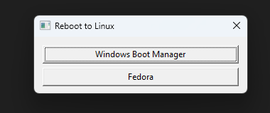

# Reboot Linux

A simple and lightweight Rust application with minimal dependencies to reboot a Windows system to Linux through bcdedit. Although this is designed to boot into Linux, there is no reason this can't boot into other operating systems as long as it has a UEFI entry.

# Install

I recommend installing this as a start menu entry so it is easily accessible. Alternatively, you can keep the executable on your desktop.

To add to start menu:

1. Grab the latest executable from [releases](https://github.com/xethlyx/reboot-to-linux/releases) or compile it yourself
2. Place the executable somewhere where it won't be moved or deleted (maybe your documents folder or AppData)
3. Create a shortcut to the executable and place it in `%appdata%\Microsoft\Windows\Start Menu\Programs`
4. Find the shortcut in your start menu, right click and pin to start. Optionally change the icon of the shortcut in properties